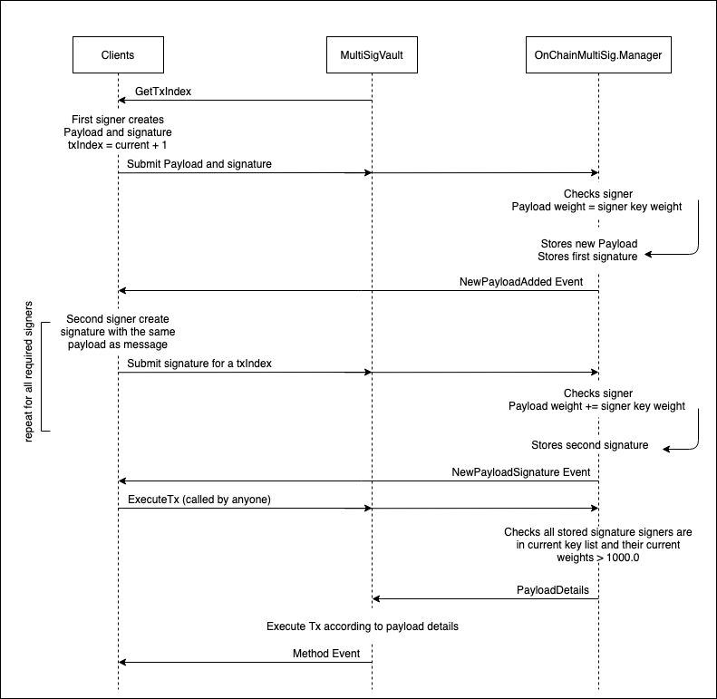

<!-- markdownlint-configure-file { "MD013": { "line_length": 120 } } -->

# OnChainMultiSig

**NOTE: This repository is currently not maintained.**

This repository is the source code for the `OnChainMultiSig` contract.

The `OnChainMultiSig` contract is designed to address the need for
multiple signature to authorise transactions without [time constraint] or [gas balance].

## Motivation

The motivation for this contract is in three parts:

1. **Limited Time Constraint** Natively, Flow suports multiple signers to authorise account transaction
with the innovative [`Weighted Keys`] in the [`Accounts`] system.
However, transactions all have expiration window (measured in blocks).
This is about [10 minutes] on the Mainnet.
It may not always be feasible or user friendly to require multisig key holder to be
present to sign everytime a transaction is required.

2. **Standardisation** It is common for an account to have multiple resources in their storage path and that
these resources all require the multisig feature. It will be easier for frontend developers or users to compose
signatures that captures the intention of the signer securely.

3. **Gas requirement** It should not be required that the signers of a multisig resource must
all have balance in an account, the signatures themselves should be enough to authorise
transactions of which some other [`payer`] (or themselves) can pay for.

## Solution

To address the time constraint, as the name suggests, the signatures are temporarily stored on chain.
Once all required signatures are ready, anyone can call the public method to execute the transaction.

Interfaces are defined to facilitate standardising this onchain signature storage across different resources.

Finally, following Flow's decoupling principle between account and keys,
the signature for a multisig transaction can be sumbitted by a trusted [`payer`],
independent to the account that owns the resource[^1] or the key.
This allows signers to simply be some entity that holds some private key where the corresponding public
key has been added as part of the resource's multisig public key list with some weight.

### Method Details

`OnChainMultiSig` contract provides a `Manager` resource which is intended to be created and stored by resources that
supports onchain multisig.
In addition, `PublicSigner` interface is provided for the resources as a standard interface for transactions to:

1. `addNewPayload`: Create a new payload and signature for it to be stored.
The `TxIndex` must be the current index incremented by one and is included in the signature.
Signature must be produced by the public key in `@Manager.keyList`
2. `addPayloadSignature`: Submit a signature for a payload that was added.
Signature must be produced by the public key in `@Manager.keyList`
3. `executeTx`: Execute a transaction (if all signatures required have been submitted)

and queries for:

1. `UUID`: gets the uuid of the multisig resource
2. `getTxIndex`: gets the sequentially assigned current txIndex of multisig pending tx of this resource
3. `getSignerKeys`: gets the list of public keys for the resource's multisig signers
4. `getSignerKeyAttr`: gets the stored key attributes

Internal to the `Manager` resource, it implements the `SignatureManager` interface which allows the implementation of `PublicSigner`
functions on the multisig supported resources to work with the `Manager`.

## Usage

We have used a simple `Vault` resource in the `MultiSigFlowToken` contract to demonstrate the usage of the `PublicSigner`,
how to form a [onchain-multisig signature],
transacting with the `MultiSigFlowToken` contract and [resource owner account management].

A happy path is demostrated in this diagram:

### Signatures

The message in the signature verified by the `Manager` resource are as such, in order:

- `txIndex: UInt64`: The txIndex of the payload. For a new payload, this must be the latest txIndex + 1
- `method: String`: The name of the method the multisig supported resource uses
- `arg: AnyStructure`: The arguments that are needed (currently supports: `String`, `UInt64`, `UFix64`, `Address`)

Example of how the signer may construct their message to ensure the encoding to bytes align with the cadence
encoding in the contract can be found in  `GetSignableDataFromScript` in `util.go`,
which uses the script in `scripts/calc_signable_data.cdc`.

The signing example can be found in `SignPayloadOffline` in `util.go`.

**Note**: The current version only supports `hashAlgorithm: HashAlgorithm.SHA3_256`

## Resource Owner Account Management

Whilst it is possible to allow for onchain multisig feature to be available for resources,
to limit the use to *just* be in that way will ultimately depend on the account that owns the resources.

As such, the account with such a resource should itself have all the keys added so that the `weights`
of each authorizer is consistent for the resource and the account. This is because if one key
is added to the account, that key has the ability to directly call functions in `Manager` to alter the states.

Another approach may be that once the resource has been added, all keys for the owner account is revoked.
This limits the flexibility of the account but it may be neccessary, similar to [immutable contracts] in Flow.

[onchain-multisig signature]: (#signatures)
[immutable contracts]: <https://docs.onflow.org/concepts/accounts-and-keys/#account-creation>
[decoupled]: <https://docs.onflow.org/concepts/accounts-and-keys/#account-creation>
[10 minutes]: <https://docs.onflow.org/flow-go-sdk/building-transactions/#reference-block>
[`payer`]: <https://docs.onflow.org/flow-go-sdk/building-transactions/#payer>
[gas balance]: <https://docs.onflow.org/flow-go-sdk/building-transactions/#payer>
[time constrains]: <https://docs.onflow.org/flow-go-sdk/building-transactions/#reference-block>
[`Accounts`]: <https://docs.onflow.org/concepts/accounts-and-keys/#accounts>
[`Weighted Keys`]: <https://docs.onflow.org/concepts/accounts-and-keys/#weighted-keys>
[resource owner account management]: (#resource-owner-account-management)
[^1]: Please see [resource owner account management] for details
